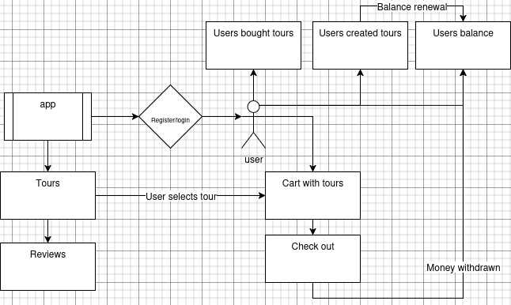

# Zentour


## About
**Zentour** is a web application for booking tours, created as a convenient tool for tourists and tour operators.
The main goal of the project is to simplify the process of searching, booking, and managing tourist trips.

## Main features
- View available tours with detailed descriptions and visualisations;
- Manage your profile and balance;
- Book tours and track transactions;
- Tour operators can create their own tours after confirming their **Super User** status.

The project is built on **Django**, making it easily expandable and convenient for further integration with other services.

## Technologies

### Backend


### Frontend


### DevOps


## Installation
To get started with **Zentour**, follow these steps:

1. **Clone the repository:**

    ```bash
    git clone https://github.com/Nechitosik228/Django_Final_Project.git
    ```
2. **Create a virtual environment (venv):**

+ For Windows (PowerShell):
    ```powershell
    python -m venv .venv
    ```
+ For GNU/Linux & macOS:
    ```bash
    python3 -m venv .venv
    ```
3. **Activate the virtual environment:**
+ For Windows (PowerShell):
    ```powershell
    .\.venv\Scripts\activate.ps1    
    ```
+ For GNU/Linux and macOS:
    ```bash
    source .venv\bin\activate
    ```
4. **Install the required dependencies:**
    ```bash
    pip install -r requirements.txt 
    ```
5. **Run database migrations:**
    ```bash
    cd zentour
    python manage.py migrate
    ```
6. **Run the development server:**
    ```bash
    python manage.py runserver
    ```

## Reports



---
# Translation to [Ukrainian](README.uk.md)

# The documentation is under development, so it may not be clear or work correctly :warning: :warning: :warning:
