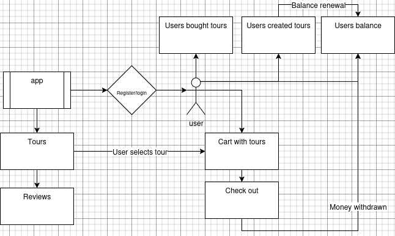

# Zentour


## Опис
**Zentour** – це веб-додаток для бронювання турів, створений як зручний інструмент для туристів і туроператорів.  
Основна мета проєкту – спростити процес пошуку, бронювання та управління туристичними подорожами.

## Основні можливості
- Переглядати доступні тури з детальним описом і візуалізацією;
- Керувати власним профілем і балансом;
- Бронювати тури та відслідковувати транзакції;
- Туроператорам створювати власні тури після підтвердження статусу **Super User**.

Проєкт побудований на **Django**  він є легко розширюваним та зручним для подальшої інтеграції з іншими сервісами.

## Вимоги
Для запуску цього проекту вам потрібні:
- [Ключ](#ключ-доступу) доступу до API
- Встановлений [docker](https://docs.docker.com/)
- Секретний ключ -> [Генератор](https://djecrety.ir/)
- Налаштування БД -> [Документація](https://docs.djangoproject.com/en/5.2/ref/databases/#id13)
- Email [host](#email-host) та пароль для надсилання електронних листів

## Ключ доступу
1. **Аутентифікація:**

    [Зареєструйтесь](https://mailboxlayer.com/signup?plan=797&billing=yearly) або [увійдіть](https://mailboxlayer.com/login) на вебсайт API

2. **Отримання ключа:**

    Перейдіть до вашої [панелі управління](https://mailboxlayer.com/dashboard), і там ви знайдете ключ доступу. Скопіюйте його, а потім переходьте до [Інсталяції](#інсталяція)

## Email host
1. **Вимога:**

    Вам потрібна двофакторна аутентифікація на вашому [обліковому записі Google](https://myaccount.google.com/u/1/signinoptions/twosv)
2. **Створення пароля:**

- Перейдіть на [Паролі додатків](https://myaccount.google.com/apppasswords)

- Введіть ім'я для пароля

- Потім скопіюйте пароль, який з'явиться, адже як тільки ви закриєте вікно, ви не зможете побачити пароль

- Потім переходьте до [Інсталяції](#installation)

Повний покроковий [Посібник](https://www.geeksforgeeks.org/python/setup-sending-email-in-django-project/)


## Технології

### Backend


### Frontend


### DevOps


## Інсталяція
Щоб розпочати роботу з **Zentour**, виконайте такі кроки:

1. **Скопіювати репозиторій:**

    ```bash
    git clone https://github.com/Nechitosik228/Django_Final_Project.git
    ```
2. **Створити віртуальне середовище (venv):**

+ Для Windows (PowerShell):
    ```powershell
    python -m venv .venv
    ```
+ Для GNU/Linux & macOS:
    ```bash
    python3 -m venv .venv
    ```
3. **Активувати віртуальне середовище:**
+ Для Windows (PowerShell):
    ```powershell
    .\.venv\Scripts\activate.ps1    
    ```
+ Для GNU/Linux and macOS:
    ```bash
    source .venv\bin\activate
    ```
4. **Встановіть необхідні залежності:**
    ```bash
    cd zentour
    pip install -r requirements.txt 
    ```
5. **Вставте .env змінні:**

    стеріть .example з файлу .env.example
    ```bash
    SECRET_KEY = "YOUR_SECRET_KEY"

    EMAIL_HOST_USER = 'YOUR_EMAIL'
    EMAIL_HOST_PASSWORD = 'YOUR_APP_PASSWORD'

    API_KEY = 'YOU_API_KEY'

    DB_NAME = 'YOUR_DB_NAME'
    DB_USER = 'YOUR_USER'
    DB_PASSWORD = 'YOUR_PASSWORD'
    DB_HOST = 'YOUR_HOST'
    DB_PORT = 'YOUR_PORT'
    ```
6. **Запуск докера:**
    ```bash
    docker-compose up --build
    ```

## Структура Проекту
```
Django_Final_Project
├─ LICENSE
├─ README.md
├─ README.uk.md
└─ zentour
   ├─ .dockerignore
   ├─ accounts
   │  ├─ admin.py
   │  ├─ apps.py
   │  ├─ forms.py
   │  ├─ migrations
   │  │  ├─ 0001_initial.py
   │  │  ├─ 0002_alter_profile_avatar_alter_profile_user.py
   │  │  ├─ 0003_alter_profile_avatar.py
   │  │  ├─ 0004_alter_profile_avatar.py
   │  │  ├─ 0005_transaction.py
   │  │  ├─ 0006_transaction_category_transaction_status.py
   │  │  ├─ 0007_alter_transaction_options.py
   │  │  ├─ 0008_profile_email_confirmed_profile_pending_email.py
   │  │  └─ __init__.py
   │  ├─ models.py
   │  ├─ signals.py
   │  ├─ templates
   │  │  └─ accounts
   │  │     ├─ balance.html
   │  │     ├─ edit_profile.html
   │  │     ├─ emails
   │  │     │  └─ reset.html
   │  │     ├─ login.html
   │  │     ├─ password_change.html
   │  │     ├─ password_change_done.html
   │  │     ├─ profile.html
   │  │     ├─ register.html
   │  │     ├─ reset_password
   │  │     │  ├─ complete.html
   │  │     │  ├─ confirm.html
   │  │     │  ├─ done.html
   │  │     │  └─ form.html
   │  │     ├─ superuser.html
   │  │     └─ transactions.html
   │  ├─ test
   │  │  ├─ fixtures.py
   │  │  ├─ test_endpoints.py
   │  │  ├─ test_forms.py
   │  │  ├─ test_models.py
   │  │  └─ __init__.py
   │  ├─ urls.py
   │  ├─ utils
   │  │  ├─ decorator
   │  │  │  ├─ confirm_email.py
   │  │  │  └─ __init__.py
   │  │  └─ __init__.py
   │  ├─ views.py
   │  └─ __init__.py
   ├─ conftest.py
   ├─ docker-compose.yml
   ├─ Dockerfile
   ├─ images
   │  ├─ logo.jpg
   │  └─ zentour.drawio.png
   ├─ manage.py
   ├─ pytest.ini
   ├─ requirements.txt
   ├─ tours
   │  ├─ admin.py
   │  ├─ apps.py
   │  ├─ forms.py
   │  ├─ migrations
   │  │  ├─ 0001_initial.py
   │  │  ├─ 0002_cartitem_order_orderitem.py
   │  │  ├─ 0003_rename_image_path_tour_image.py
   │  │  ├─ 0004_tour_user.py
   │  │  ├─ 0005_alter_tour_image.py
   │  │  ├─ 0006_review.py
   │  │  ├─ 0007_remove_tour_available.py
   │  │  ├─ 0008_alter_cart_user_alter_orderitem_items.py
   │  │  ├─ 0008_alter_cart_user_alter_review_tour.py
   │  │  ├─ 0009_remove_orderitem_items_orderitem_order.py
   │  │  ├─ 0010_merge_20250718_0720.py
   │  │  ├─ 0011_tour_buyers.py
   │  │  ├─ 0012_remove_tour_buyers_alter_tour_discount_and_more.py
   │  │  ├─ 0013_boughttour_price.py
   │  │  ├─ 0014_remove_orderitem_price.py
   │  │  ├─ 0015_alter_boughttour_amount.py
   │  │  ├─ 0016_boughttour_seats.py
   │  │  ├─ 0017_cartitem_timestamp.py
   │  │  └─ __init__.py
   │  ├─ models.py
   │  ├─ static
   │  │  └─ js
   │  │     └─ review_star.js
   │  ├─ tasks.py
   │  ├─ templates
   │  │  └─ tours
   │  │     ├─ base.html
   │  │     ├─ cart.html
   │  │     ├─ checkout.html
   │  │     ├─ create_tour.html
   │  │     ├─ delete_review.html
   │  │     ├─ delete_tour.html
   │  │     ├─ edit_tour.html
   │  │     ├─ home.html
   │  │     ├─ ticket_check.html
   │  │     ├─ tour_detail.html
   │  │     └─ users_tours.html
   │  ├─ test
   │  │  ├─ fixtures.py
   │  │  ├─ test_endpoints.py
   │  │  ├─ test_forms.py
   │  │  ├─ test_models.py
   │  │  └─ __init__.py
   │  ├─ urls.py
   │  ├─ utils
   │  │  ├─ calculate_star.py
   │  │  ├─ create_pdf.py
   │  │  ├─ generate_token.py
   │  │  ├─ send_email.py
   │  │  ├─ transaction.py
   │  │  └─ __init__.py
   │  ├─ views.py
   │  └─ __init__.py
   └─ zentour
      ├─ asgi.py
      ├─ celery.py
      ├─ settings.py
      ├─ urls.py
      ├─ wsgi.py
      └─ __init__.py
```
## Додатково



---
# Переклад [Англійською](README.md)
